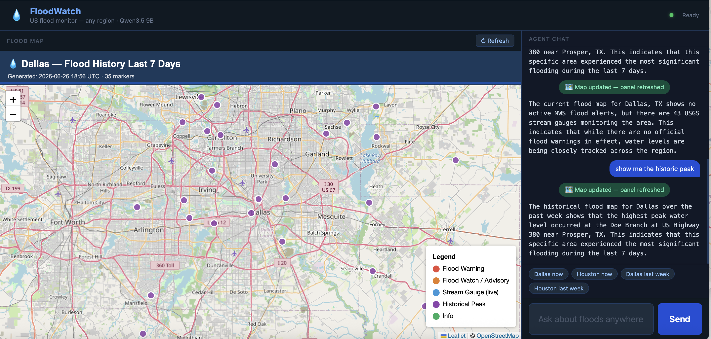

# FloodWatch Agent



A conversational agent that fetches real-time and historical flood data for **any US city or region** and generates an interactive map in your browser. Powered by Qwen3.5 9B via Ollama and LangChain.

## Data sources

- **NOAA NWS** — active flood warnings, watches, and advisories filtered to the requested region
- **USGS Water Services (live)** — real-time streamflow (cfs) and gage height (ft) from stream gauge stations across the region
- **USGS Water Services (historical)** — daily peak streamflow and gage height for the past N days; used to answer where it flooded recently and how high the water got
- **OpenStreetMap Nominatim** — geocoding to resolve city/region names to bounding boxes

## Prerequisites

1. **Ollama** running locally with the `qwen3.5:9b` model pulled:
   ```bash
   ollama pull qwen3.5:9b
   ollama serve          # if not already running
   ```

2. **Dependencies:**
   ```bash
   pip install -r requirements.txt
   ```

## Running the agent

### Standalone web app (recommended)

```bash
python app.py
```

Then open **http://localhost:8080** in your browser. The left panel is the agent chat; the right panel shows the flood map and refreshes automatically whenever the agent generates a new one.

### CLI (terminal only)

```bash
python main.py
```

## Example prompts

### Current conditions — any US region

```
Show me current flood conditions in Houston, TX
What are the active flood warnings in New Orleans?
Generate a flood map for Nashville, Tennessee
Show live stream gauge levels in Phoenix, AZ
```

### Historical flooding — any US region

```
Show me where it flooded in Dallas last week
Map flood peaks in Houston for the past 3 days
Where did it flood in Miami over the last 14 days?
Show historical flood data for Chicago, IL
```

The agent geocodes the location automatically and defaults to Dallas, TX if no location is specified. You can specify any number of days (max 30).

### How it works

**Current map:**
1. Geocodes the requested city/region to get a bounding box
2. Fetches live NWS flood alerts for the state, filtered to the region's bbox
3. Fetches real-time USGS stream gauge readings within the bbox
4. Generates an interactive Leaflet.js map and displays it in the browser

**Historical map:**
1. Geocodes the requested city/region
2. Fetches USGS daily peak values for the requested date range within the bbox
3. Plots stations by peak gage height (highest peaks = worst-hit locations)
4. Summarizes top flooded areas, peak heights/flows, and when each peaked

## Map marker colors

| Color | Meaning |
|-------|---------|
| Red | Active Flood Warning / Flash Flood Warning |
| Orange | Flood Watch or Flood Advisory |
| Blue | USGS stream gauge (live reading) |
| Purple | Historical peak flood location |
| Green | General info point |

Marker size reflects confirmed flood severity: NWS warning markers are largest, watch markers medium; gauge dots are uniform and small.

## Static map snapshots

Pre-generated HTML maps are in `static/`. To regenerate them with fresh data:

```bash
python generate_static.py
```

## Other commands

| Input | Effect |
|-------|--------|
| `clear history` | Wipe conversation memory and start fresh |
| `exit` | Quit the agent |

## Files

```
flood_vizualization_agent/
├── app.py                     # Standalone FastAPI web app (chat + map UI)
├── main.py                    # CLI agent entry point
├── flood_tools.py             # Tool functions (NWS, USGS, geocoding, map generation)
├── requirements.txt           # Python dependencies
├── static/
│   ├── index.html             # Web UI (two-panel: chat left, map right)
│   └── dallas_last_week.html  # Static snapshot: Dallas flood history, last 7 days
├── flood_map.html             # Generated map (created on first run, gitignored)
└── conversation_history.json  # Persisted chat history (auto-created, gitignored)
```
